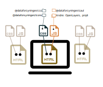
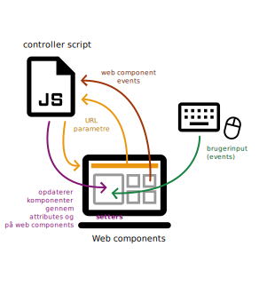

# System overview

`skraafoto_frontend` **(Skraafoto)** is an application that enables users to browse **skewed arial photographs (skråfotos)** in a web browser.

## Services related to Skraafoto

Skraafoto itself is just a HTML/JS application that is downloaded to a browser. 
From here, it fetches data from various sources to browse skråfotos. These sources are:

- [Skråfoto STAC API](https://github.com/SDFIdk/skraafoto_stac_public/blob/main/dokumentation.md)
  For searching through skråfoto metadata 
- Skråfoto server 
  For fetching skråfoto images
- [Danmarks højdemodel koter](https://datafordeler.dk/dataoversigt/danmarks-hoejdemodel-dhm/koter/) and [WCS services](https://datafordeler.dk/dataoversigt/danmarks-hoejdemodel-dhm/dhm-wcs/)
  For fetching elevation data to aid in calculating positions within skråfotos
- [Dataforsyningen maps](https://dataforsyningen.dk/data/962)
  To display a map that gives the user some context as to where the skråfoto was taken

## The Skraafoto application

The Skraafoto application is a simple collection of HTML pages.
Pages reside in the `public/` directory.

There is no javascript single page application or rendering system on the server side.
Routing between pages is as simple as linking to other HTML pages.

While this results in some repeated markup across pages, this approach makes it simple to extend the application with custom views and ensures a high level of accessibility.

### Views

Each HTML page represents a "view".
You can add more views simply by adding a HTML file and linking to it from some other page.

<em>Example:</em> The "skråfoto viewer" view is `public/viewer.html`. 
This corresponds to "skraafoto.dataforsyningen.dk/viewer.html` in the browser.
Each view imports some tailored Javascript and common style sheets. 

### View Javascripts

The build system is set up to create individual Javascript bundles for every view. 
The Javascript bundles are build from entry files in `src/views/` directory. Entry files are named to correspond with HTML views. These bundled scripts import all external libraries needed within the bundle.

The scripts in `src/views/` act as **controllers** for the view pages. They have the following responsibilities:

- Include and register **web components**
- Orchestrate communication between components 

Individual web components may import 3rd party modules.

<em>Example:</em> `viewer.html` imports `viewer.js` script (from `dist/` directory). 
`viewer.js` is built from `src/views/viewer.js` which in turn imports the web component `SkraaFotoViewport` from the `src/components/` directory.
`SkraaFotoViewport` imports whatever classes and functions it needs from other modules, including 3rd party modules like [SAUL](https://www.npmjs.com/package/@dataforsyningen/saul) and [OpenLayers.](https://www.npmjs.com/package/ol)

### View style sheets (CSS)

Views import some common CSS (`style.css`) that is built with parts from these modules: [@dataforsyningen/css](https://www.npmjs.com/package/@dataforsyningen/css) and [@dataforsyningen/icons](https://www.npmjs.com/package/@dataforsyningen/icons).

Indvidual web components include custom CSS that is bundled with the view's Javascript.

### Web components

A view's user interface is built from individual **[web components.](https://developer.mozilla.org/en-US/docs/Web/Web_Components)**

Web components is a web standard for creating reusable custom elements. They include their own logic, markup, and styles.
A view will usually contain some **controller** Javascript and a number of web components.
Ideally, web components should only display UI updates and not contain any business logic. 

### Relation between controllers and web components

The controller or other components can transfer input to web components in various ways:

- By setting element attributes 
- By using class `set` methods

Web components communicate back to the controller by dispatching [custom events](https://developer.mozilla.org/en-US/docs/Web/API/CustomEvent).
Event listeners in the controller causes it act on these events.

#### User inputs

Individual web components handle user inputs by listening to events. The componont may react by dispatching other (custom) events to be handled by the controller.

#### State management

There is no global Javascript state object. 

Instead, because the Skraafoto application is sharable by link, query string parameters in the URL are used to keep track of application state.
