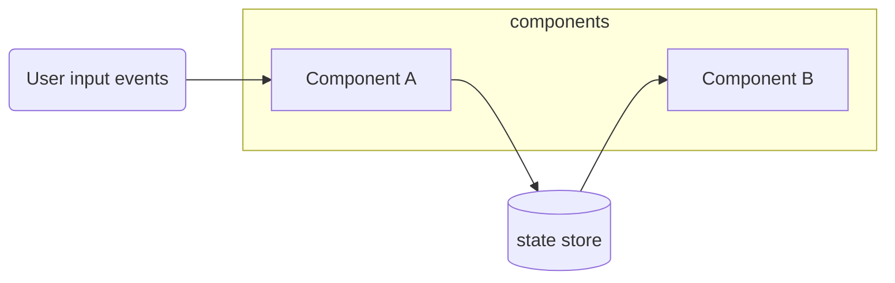

# User inputs, dataflow, and state management

Communication between componens is handled by a **state store.** Refer to the `src/store` directory to lean about the various state properties and methods.

Individual web components handle user interactions by listening to events such as `click`, `change`, etc. 
Components may react to user inputs by updating the shared state which in turn may cause other components to be updated.



## State store

We've created a simple state management module to enable different components to share and exchange data amongst themselves.

### Update state property

The state is updated by calling its `dispatch` method.
When a `dispatch` has been called, the state object is updated, and a custom event is fired. 

You can look up `/src/store/state.js` to see what actions are available.

Example updating the `view` property with a new value:
```
import store from '@/store'

const newView = { 
  center: [574764, 6220953],
  zoom: 10
}
store.dispatch('updateView', newView)
```

### Listen for changes to a state property

When a property in the store is changed, an event is dispatched with a type that corresponds to the property name.
You can simply add event listeners to pick up on changes to a certain property.

For some dispatch events, the updated state is available from the `detail` property on the event object. You may also look up the property directly from the store.

Example listening for changes to `view` property:
```
import store from '/src/store'

window.addEventListener('updateView', (event) => {
  // Get new value from event details
  const newViewA = event.detail.view
  // Get new value from store
  const newViewB = store.state.view
})
```
