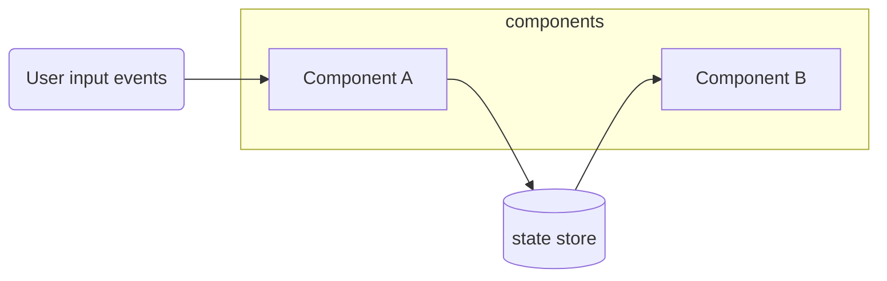

# User inputs, dataflow, and state management

Communication between componens is handled by a **state store.** Refer to the `src/store` directory to lean about the various state properties and methods.

Individual web components handle user interactions by listening to events such as `click`, `change`, etc. 
Components may react to user inputs by updating the shared state which in turn may cause other components to be updated.



## State store

Skråfoto uses [MobX state management](https://mobx.js.org/) module to enable different components to share and exchange data amongst themselves.

You can look up `/src/state/index.js` to check what properties and actions are available.

Here is a simple example of how state is read and updated within a component:
```
import { state, reaction, when, autorun } from '../../state/index.js'

let viewPosition

// Reading a state property directly
viewPosition = state.view.position

// React when a state property is changed
autorun(() => {
  viewPosition = state.view.position
})

// Setting state properties
state.setView = {position: [574764,6220953]}
```