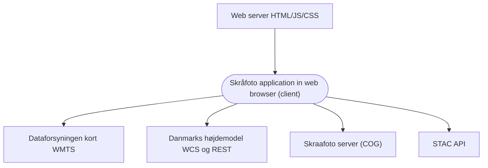

# System overview

`skraafoto_frontend` **(Skraafoto)** is an application that lets users browse **oblique arial photographs (skråfotos)** in a web browser.
This section provides an overview of Skraafoto and its internal architecture.

## Services related to Skraafoto

Skraafoto itself is just a HTML/JS application that is downloaded to a browser. 
From here, it fetches data and images from various sources to browse skråfotos. These sources are:

- [Skråfoto STAC API](https://github.com/SDFIdk/skraafoto_stac_public/blob/main/dokumentation.md)
  For searching through skråfoto metadata 
- Skråfoto server 
  For fetching skråfoto images
- [Danmarks højdemodel](https://datafordeler.dk/dataoversigt/danmarks-hoejdemodel-dhm/koter/) and [WCS services](https://datafordeler.dk/dataoversigt/danmarks-hoejdemodel-dhm/dhm-wcs/)
  For fetching elevation data to aid in calculating positions within skråfotos
- [Dataforsyningen maps](https://dataforsyningen.dk/data/962)
  To display a map that gives the user some context as to where the skråfoto was taken
  
The relations are illustrated below:

_Fig. 1: Skraafoto web application and its related webservices_

## The Skraafoto application

The Skraafoto application is a simple collection of HTML pages.
Pages reside in the `public/` directory.

There is no javascript single page application or rendering system on the server side.
Routing between pages is as simple as linking to other HTML pages.
While this results in some repeated markup across pages, this approach makes it simple to extend the application with custom views and ensures a high level of accessibility.

### Views

Each HTML page represents a "view".
You can add more views simply by adding a HTML file and linking to it from some other page.

<em>Example:</em> The "skråfoto twinview" view is `public/twinview.html`. 
This corresponds to "skraafoto.dataforsyningen.dk/twinview.html` in the browser.

Each view imports some tailored Javascript and common CSS.

### View Javascripts

The build system is set up to create individual Javascript bundles for every view. 
The Javascript bundles are build from entry files in `src/views/` directory. Entry files are named to correspond with HTML views. These bundled scripts import all external libraries needed within the bundle.

The scripts in `src/views/` have the following responsibilities:

- They include and register **web components.**
- They add some global event listeners and methods.

Individual web components may import 3rd party modules.
Web components in turn communicate via events and a shared state using [MobX.](https://mobx.js.org/)

<em>Example:</em> `index.html` loads `viewer.js` script (from `dist/` directory). 
`viewer.js` is built from `src/views/viewer.js` which in turn imports the web component `SkraaFotoViewport` from the `src/components/` directory.
`SkraaFotoViewport` imports whatever classes and functions it needs from other modules, including 3rd party modules like [SAUL](https://www.npmjs.com/package/@dataforsyningen/saul) and [OpenLayers.](https://www.npmjs.com/package/ol)

### Web components

A view's user interface is built from individual **[web components.](https://developer.mozilla.org/en-US/docs/Web/Web_Components)**

Web components is a web standard for creating reusable custom elements. They include their own logic, markup, and styles.
A view will usually contain some **controller** Javascript and a number of web components.
Ideally, web components should only display UI updates and not contain any business logic. 

### User inputs, dataflow, and state management

[Read more about user inputs, dataflow and state management here.](./dataflow.md)
